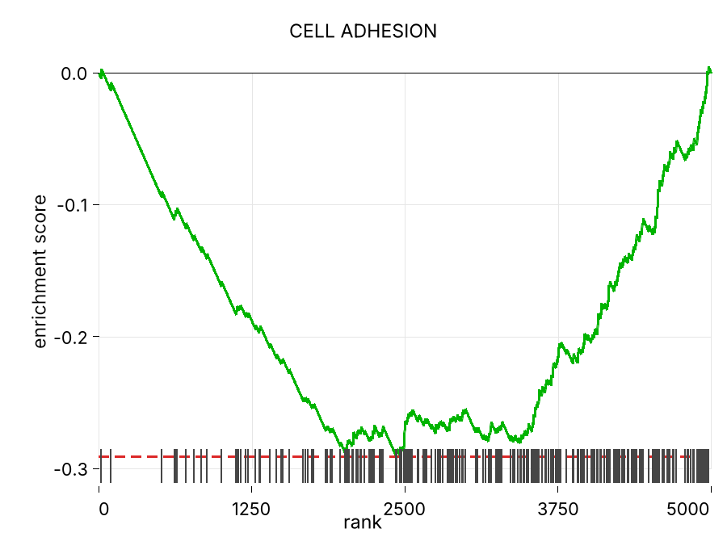
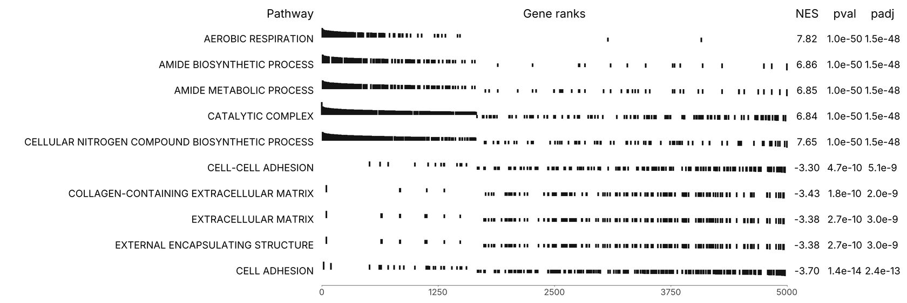

# rsfgsea: Decor, Classic fgsea, and Native Blitz GSEA

High-performance Rust implementation of preranked Gene Set Enrichment Analysis (GSEA) with three public tracks: `rsfgsea-decor` for redundancy-aware enrichment, classic fgsea-compatible simple and multilevel workflows, and native blitzGSEA-compatible execution.

## Features

- **rsfgsea-decor**: A redundancy-aware preranked GSEA method that downweights pathway genes with high expression-derived within-pathway correlation. Decor uses validated presets (`sensitive`, `balanced`, `specific`, `strict`), with `balanced` as the release default, plus an optional 0-100 stringency ladder for preset autoswitching.
- **Classic fgsea Parity**: Reproduces fgsea-style simple and multilevel workflows with NES, adjusted p-values, and `log2err`; current CPU multilevel parity vs R is near floating-point noise (max abs diff about `5e-9`, see [Precision vs R](#precision-vs-r) and `crates/rsfgsea/tests/r_validation.rs`).
- **Native Blitz Mode**: Adds `mode=blitz` across Rust, CLI, Python, and R with native Rust execution against the local `blitzgsea 1.3.54` reference target. Current parity is exact parsed equality on committed synthetic, edgecase, and publication fixtures; on the 63,904-gene `lung vs muscle` DESeq2 + GO BP test case (5,324 pathways), max finite diffs are ES `5.6e-16`, NES `2.3e-7`, p-value `1.8e-15`, and FDR `3.8e-15`.
- **Fast Core Algorithms**: Uses \(O(k)\) ES kernels and size-group batching to avoid redundant work; on current large 1-worker comparison workloads, `rsfgsea` is about **3.0x faster** in simple mode and **4.1x faster** in multilevel mode than R `fgsea`.
- **Built-In Plotting**: Writes single-pathway enrichment plots and multi-pathway GSEA table plots as PNG directly from Rust, CLI, Python, and R.
- **Hybrid CPU/GPU Engine (Experimental)**: WebGPU accelerates large simple-stage screening/null generation, while multilevel refinement uses the parity-focused CPU kernel.

## Usage

### As a Binary

```bash
# Install from crates.io
cargo install rsfgsea

# Or build from a repository checkout
git clone https://github.com/deminden/rsfgsea
cd rsfgsea
cargo build --workspace --release
```

Decor is the first public track for redundancy-aware preranked GSEA. It runs as
a fixed-permutation simple workflow. The minimal CLI keeps the validated default
preset: `balanced`, implemented as threshold-rational decor with `tau=0.04`
and `alpha=60`.

```bash
rsfgsea \
    --method decor \
    --mode simple \
    --nperm 10000 \
    --ranks data/pearson_symbols.rnk \
    --gmt data/h.all.v2025.1.Hs.symbols.gmt \
    --output results.decor.tsv \
    --decor-cache cache/hallmark.decor.tsv \
    --decor-expression data/expression.tsv
```

Use `--decor-preset specific` when you want an explicit preset, or
`--decor-stringency 75` when you want the preset ladder to choose for you.

Classic fgsea-compatible mode remains available when you want simple or
multilevel behavior aligned with R `fgsea`:

```bash
rsfgsea \
    --ranks data/pearson_symbols.rnk \
    --gmt data/h.all.v2025.1.Hs.symbols.gmt \
    --output results.tsv
```

Blitz mode is the third public track. It is native Rust, not a Python delegation
layer, and is available as `mode=blitz` in Rust, CLI, Python, and R.

```bash
rsfgsea \
    --mode blitz \
    --ranks data/pearson_symbols.rnk \
    --gmt data/h.all.v2025.1.Hs.symbols.gmt \
    --output results.blitz.tsv
```

Blitz mode uses `blitzgsea.gsea()` defaults where applicable:
`permutations=1000`, `anchors=40`, `min_size=5`, `max_size=4000`,
`processes=4`, `symmetric=false`, `seed=0`, `center=true`, `accuracy=40`, and
`deep_accuracy=50`. It rejects `gpu`, `method=decor`, `nperm`,
`scoreType != "std"`, and `gseaParam != 1.0`.

### As a Crate

Add to `Cargo.toml`:
```toml
[dependencies]
rsfgsea = "0.3.4"
```

Or use the repository directly:

```toml
[dependencies]
rsfgsea = { git = "https://github.com/deminden/rsfgsea" }
```

Use in code:
```rust
use rsfgsea::prelude::*;

let ranks = RankedList::new(genes, scores);
let pathways = read_gmt("pathways.gmt")?;

// Wrapper-style API (closest to R fgsea semantics).
let results = fgsea_with_sample_size(
    &ranks,
    &pathways.pathways,
    None,
    1000,
    42,
    1,
    ranks.len() - 1,
    1e-50,
    ScoreType::Std,
    1.0,
    101,
);
```
### Python Extension

The Python package is published as `rsfgseapy`.

```bash
# Install from PyPI
pip install rsfgseapy

# Or build from a repository checkout
git clone https://github.com/deminden/rsfgsea
cd rsfgsea
cd crates/rsfgseapy
maturin develop --release
```

Classic usage example:
```python
import rsfgseapy

# Classic wrapper-style run
results = rsfgseapy.run_gsea_py(
    ranks={"GENE_A": 2.0, "GENE_B": 1.0, "GENE_C": -1.0, "GENE_D": -2.0},
    gmt_path="pathways.gmt",
)

for res in results:
    print(res["pathway"], res["pval"])
```

How to think about `nPermSimple` vs `nperm`:

- `nPermSimple` is the normal simple-stage permutation count used by wrapper mode.
- `nperm` is an explicit override that forces wrapper mode into fixed-permutation simple behavior.
- Leave `nperm=None` unless you intentionally want simple mode.
- Change `nPermSimple` when you want to tune the default wrapper-stage screening budget.

Default fgsea-style parameters in this project interfaces:
- `mode=fgsea`
- `gpu=False`
- `nPermSimple=1000`
- `nperm=None` (if set, wrapper mode switches to simple permutations)
- `minSize=1`
- `maxSize=length(stats)-1` (computed automatically if omitted)
- `eps=1e-50`
- `sampleSize=101`
- `scoreType="std"`
- `gseaParam=1.0`
- `nproc=0`

### R Package

The R package lives in [`r-pkg/rsfgseaR`](./r-pkg/rsfgseaR) and can be installed from a repository checkout.

```bash
git clone https://github.com/deminden/rsfgsea
cd rsfgsea
R CMD INSTALL r-pkg/rsfgseaR
```

Classic minimal example:

```r
library(rsfgseaR)

stats <- c(g1 = 2, g2 = 1, g3 = -1, g4 = -2)
pathways <- list(
  PW_A = c("g1", "g2"),
  PW_B = c("g3", "g4")
)

res <- fgsea(pathways = pathways, stats = stats)
print(res[, c("pathway", "nes", "pval")])
```

Notes:
- default installs are CPU-only
- local GPU builds are available with `RSFGSEAR_ENABLE_GPU=1 R CMD INSTALL r-pkg/rsfgseaR`
- `pathways` can be a named list or a GMT path, and `stats` can be a named numeric vector or a ranked-list file path


### Plotting

Single-pathway enrichment plots and multi-pathway GSEA table plots can be
written directly from the CLI, Python, or R wrappers.

CLI:

```bash
rsfgsea-plot-enrichment \
    --ranks data/pearson_symbols.rnk \
    --gmt data/h.all.v2025.1.Hs.symbols.gmt \
    --pathway HALLMARK_APOPTOSIS \
    --output enrichment.png \
    --dpi 300 \
    --title "HALLMARK_APOPTOSIS"
```

Example enrichment plot:



Python:

```python
import rsfgseapy

rsfgseapy.write_enrichment_plot_png_py(
    ranks={"GENE_A": 2.0, "GENE_B": 1.0, "GENE_C": -1.0, "GENE_D": -2.0},
    pathway_genes=["GENE_A", "GENE_B"],
    output_path="enrichment.png",
    pathway_name="PW_A",
    dpi=300,
    title="PW_A",
)
```

R:

```r
rsfgseaR::plotEnrichment(
  pathway = c("g1", "g2"),
  stats = c(g1 = 2, g2 = 1, g3 = -1, g4 = -2),
  output = "enrichment.png",
  pathwayName = "PW_A",
  dpi = 300L,
  title = "PW_A"
)
```

For multi-pathway summaries, `rsfgsea` also writes fgsea-style table plots:



Other plotting parameters such as physical size and transparent background are
available in [`docs/plotting.md`](./docs/plotting.md).


#### GPU Support
To enable GPU acceleration, build with the `gpu` feature:
```bash
cargo build --release --features gpu
```

Current status:
- `run_gsea_gpu(...)` is a hybrid path: GPU is used for simple-stage null generation / ES screening, and CPU is still used for multilevel refinement.
- The main `rsfgsea` CLI can call the hybrid GPU path with `--gpu` when built with `--features gpu`.
- The current CLI GPU path supports wrapper-style `--mode fgsea`, including `--nperm` to force simple-only execution and custom `--sampleSize` / `--eps` for the CPU multilevel refinement stage.
- `--gpu` still rejects `--mode simple` and `--mode multilevel`; those mode names are not wired separately yet.
- `run_gsea_gpu(...)` requires a usable non-CPU WebGPU adapter. Software adapters such as `llvmpipe` are rejected.

On WSL2, CUDA can be visible while Vulkan/WebGPU still selects Mesa
`llvmpipe`. If `nvidia-smi` works but `--gpu` reports `llvmpipe`, force Mesa's
D3D12 path before running the CLI:

```bash
GALLIUM_DRIVER=d3d12 \
MESA_D3D12_DEFAULT_ADAPTER_NAME=NVIDIA \
./target/release/rsfgsea --gpu --mode fgsea \
  --ranks data/example.rnk \
  --gmt data/pathways.gmt \
  --nPermSimple 100000 \
  --output results.tsv
```

Use the hybrid GPU runner in Rust code:
```rust
let results = rsfgsea::algo::run_gsea_gpu(
    &ranks, 
    &pathways, 
    100_000,        // simple permutations
    42,             // seed
    15, 500,        // size limits
    ScoreType::Std, 
    1.0             // gsea_param
)?;
```

## Documentation

Project documentation is split into compact guides in [`docs/`](./docs/README.md):

- [`docs/cli.md`](./docs/cli.md)
- [`docs/python.md`](./docs/python.md)
- [`docs/plotting.md`](./docs/plotting.md)
- [`docs/algorithms.md`](./docs/algorithms.md)
- [`docs/development.md`](./docs/development.md)
- [`docs/reproducibility.md`](./docs/reproducibility.md)

## Input Format

**Ranked List (`.rnk`)**:
Tab-separated file with gene names in the first column and correlation scores in the second.
```
GENE1   12.34
GENE2   8.90
```

**GMT File (`.gmt`)**:
Standard Gene Matrix Transposed format.
```
PATHWAY_A  description  GENE1  GENE2  GENE3
PATHWAY_B  description  GENE4  GENE5
```

## Performance Comparison

### Local Optimization Benchmark

This is the fast benchmark used while optimizing the Rust core. It is synthetic,
but shaped like real GSEA workloads: 10k ranked genes, 1k overlapping pathways,
pathway sizes concentrated in the 15-500 range, smooth score tails, and a few
seeded enriched regions. It is separate from the file-backed R-vs-Rust
comparison benchmark below.

Run it with:

```bash
cargo bench -p rsfgsea --bench gsea_bench
```

Latest local Criterion snapshot, **AMD Ryzen 7950X3D**, release bench mode,
median of 10 samples:

| Benchmark | Workload | Median |
| :--- | :--- | ---: |
| `calculate_es_10k_100` | ES kernel, 10k genes / 100 hits | `294 ns` |
| `representative_simple` | 10k genes / 1k pathways / 10k permutations | `2.282 s` |
| `representative_multilevel` | 10k genes / 1k pathways / `nPermSimple=1000` | `3.438 s` |

For thread-scaling work, use the opt-in 5k-pathway matrix:

```bash
for t in 1 2 4 8 16; do
  RAYON_NUM_THREADS=$t RSFGSEA_THREAD_MATRIX_BENCH=1 \
    cargo bench -p rsfgsea --bench gsea_bench
done
```

Use `RSFGSEA_PERM_HEAVY_BENCH=1` for the 100k-permutation simple-mode profile,
and `RSFGSEA_HEAVY_BENCH=1` for the larger 20k-gene / 15k-pathway profile.

For native blitz speed work, run the opt-in blitz Criterion groups:

```bash
RSFGSEA_BLITZ_BENCH=1 cargo bench -p rsfgsea --bench gsea_bench
```

For the local positive DESeq2 stress workload:

```bash
scripts/bench_blitz_speed.py --reps 1 --json
```

Latest local `lung_vs_muscle + GO BP` snapshot: native Rust blitz compute
improved from `~22.2 s` to `10.29 s`; Python blitzgsea cold was `15.30 s`
and warm-cache was `3.56 s`.

### R fgsea Comparison Benchmark

Benchmarked on **AMD Ryzen 7950X3D**. Times are **median of 5 runs** (after one warmup run).

**Benchmark setup**:
- Ranked list: `data/pearson_symbols.rnk` (356 genes)
- Small pathways: `data/h.all.v2025.1.Hs.symbols.gmt` (50 total, 37 passing size filters)
- Large pathways: `data/Human_GO_AllPathways_noPFOCR_with_GO_iea_March_01_2024_symbol_renamed.gmt` (29,705 total, 5,582 passing size filters)
- Size filters: `minSize=1`, `maxSize=5000`
- Rust timing source: CLI compute timer (`GSEA_COMP_TIME_MS`) in release mode
- R timing source: `system.time(...)["elapsed"]` around `fgsea` calls
- R multicore modes: `BiocParallel::MulticoreParam(workers=16|32)` passed as `BPPARAM`

Headline results:

| Workload | Rust | R fgsea | Result |
| :--- | ---: | ---: | :--- |
| Multilevel, small, 1 worker | 2 ms | 42 ms | Rust `21.0x` faster |
| Multilevel, large, 16 workers | 105 ms | 977 ms | Rust `9.3x` faster |
| Simple, small, 1 worker | 720 ms | 2597 ms | Rust `3.6x` faster |
| Simple, large, 16 workers | 674 ms | 798 ms | Rust `1.18x` faster |

- Large multilevel workloads show the strongest CPU scaling in the current parity-preserving path.
- Small workloads are overhead-dominated and do not benefit much from more threads.
- On the committed muscle-comparison real-data validation workload, Rust used
  `81 MB` peak RSS versus R `fgseaMultilevel` at `329 MB` peak RSS, about
  `4.1x` lower memory, while running `0.21 s` versus `2.56 s`.
- Full benchmark matrices and thread-scaling tables are in [`docs/reproducibility.md`](./docs/reproducibility.md).

## Precision vs R

`rsfgsea` aims for feature and numerical parity with R's `fgsea` package.

Validation protocol:
- parity tests against R reference outputs are implemented in `crates/rsfgsea/tests/r_validation.rs`
- primary metrics are max and mean absolute differences for ES, NES, p-value, and adjusted p-value on matched pathways

Examples-folder snapshot:
- source: `data/Folder_with_examples`
- files: `23`
- seed: `42`
- `nPermSimple=1000`

Compact parity snapshot:
- multilevel:
  max `|ES|` diff `4.988e-09`, max `|NES|` diff `4.983e-09`, max `|pval|` diff `4.975e-09`, max `|padj|` diff `4.965e-09`
- simple:
  max `|ES|` diff `4.988e-09`, max `|NES|` diff `4.983e-09`, max `|pval|` diff `4.975e-09`, max `|padj|` diff `4.965e-09`

Notes:
- p-value NaN mismatch count was `0` in both modes on this run
- in this parity configuration and snapshot, ES/NES/p-value agreement is at floating-point-noise scale
- with fixed seed and settings, outputs are invariant across `nproc` values in the current CPU parity path
- for strict parity, `rsfgsea` currently preserves an upstream `fgsea`
  single-pathway simple-stage RNG quirk; this compatibility behavior should be
  removed once upstream `fgsea` fixes it
- full parity distribution tables are in [`docs/reproducibility.md`](./docs/reproducibility.md)

This section describes the CPU parity path. GPU parity is materially looser at present and is discussed separately in [GPU Accuracy vs R](#gpu-accuracy-vs-r).

### Blitz Reference

The blitz compatibility target is `blitzgsea 1.3.54` in the local Conda base stack used for reference generation: NumPy `2.4.0`, SciPy `1.16.3`, statsmodels `0.14.6`, pandas `2.3.3`, and mpmath `1.4.1`, with `PYTHONHASHSEED=0`. Committed synthetic, edgecase, and publication fixtures require exact parsed equality for ordering, ES, NES, p-value, FDR, size, and leading edge. On the larger `lung_vs_muscle` positive DESeq2 + GO BP stress case, finite max absolute diffs are ES `5.551e-16`, NES `2.287e-7`, p-value `1.776e-15`, and FDR `3.816e-15`; leading-edge sets match for all 5,324 pathways, with 74 order-only differences.

### GPU Accuracy vs R

Unlike the CPU parity path above, the current hybrid GPU path does not match R at floating-point-noise scale. It uses GPU simple-stage screening/null generation plus CPU multilevel refinement, and its parity characteristics should be interpreted separately from the CPU results.

Current GPU comparison guidance is in [`docs/reproducibility.md`](./docs/reproducibility.md).


## Contributing

Contributions are very welcome! 
If you’d like to help improve `rsfgsea`, feel free to open an issue to discuss ideas, report bugs, or request features.

Pull requests are encouraged — especially for:
- performance improvements
- correctness / numerical stability fixes for GPU mode
- additional tests (including cross-validation vs R `fgsea`)
- documentation, examples, and benchmarking

## License

MIT License.
